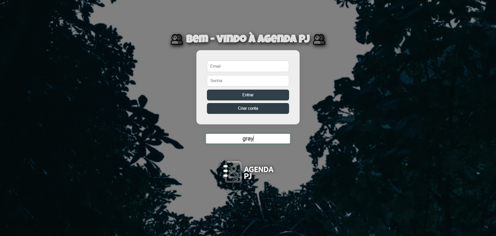
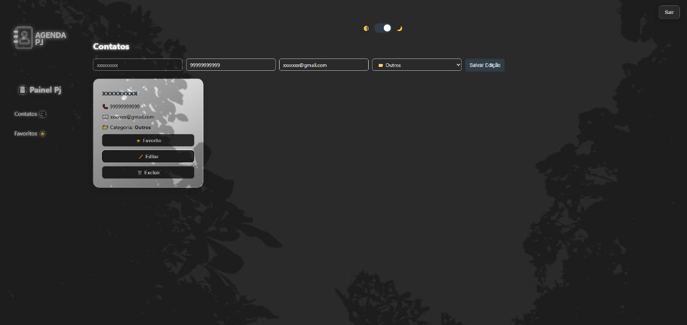

<h1 align="center">📇 Agenda PJ</h1>

<p align="center">
  Aplicativo web moderno para gerenciamento de contatos pessoais e profissionais.
</p>

<p align="center">
  
</p>

---

## 🌐 Sobre o Projeto

**Agenda PJ** é um painel onde usuários podem:

- Criar uma conta e fazer login
- Adicionar contatos com nome, telefone, email e categoria
- Visualizar todos os contatos cadastrados
- Alternar entre tema claro/escuro
- Marcar contatos como favoritos
- Salvar e manter os dados localmente com `localStorage`

---

## 🚀 Tecnologias Utilizadas

- **React**
- **React Router DOM**
- **Axios**
- **CSS moderno responsivo**
- **LocalStorage para persistência de dados**
- **Node.js + Express + MongoDB (backend hospedado)**

---

## 📸 Preview da Interface

<p align="center">
  
</p>

---

## 🔧 Como Executar

### 1. Clone o repositório

```bash
git clone https://github.com/seu-usuario/agenda-pj.git

2. Instale as dependências

npm install

3. Crie um arquivo .env na raiz

VITE_API_URL=https://apiusuarios-afl5.onrender.com

4. Execute a aplicação

npm run dev

🗂️ Estrutura de Pastas (simplificada)

src/
├── assets/
│   └── agendapjlogo.png
├── pages/
│   ├── Home/
│   │   ├── index.jsx
│   │   ├── cadastrar.jsx
│   │   └── criarcontato.jsx
├── services/
│   └── api.js
├── App.jsx
└── main.jsx
🧠 Funcionalidades
🔐 Autenticação de usuários

👤 Cadastro de novos usuários

📇 Criação de contatos

🔍 Filtragem por categoria

🌗 Tema claro/escuro

⭐ Marcar favoritos

🚪 Logout

💡 Autor
MarcoALR
```
